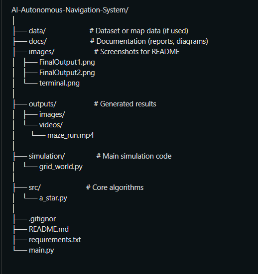
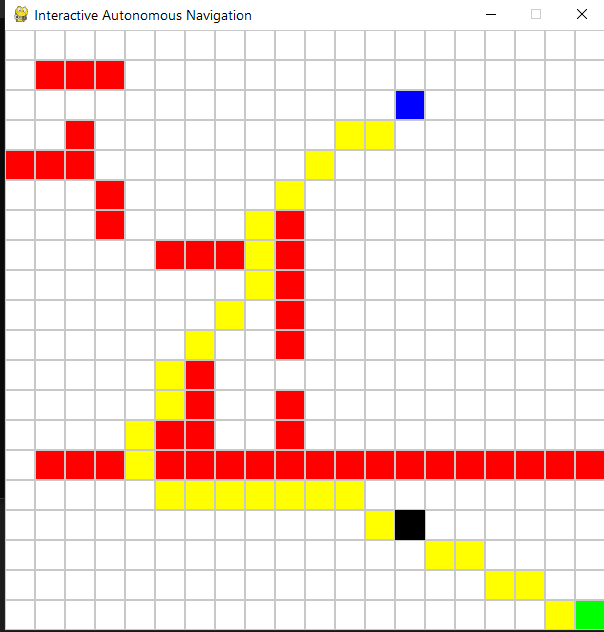
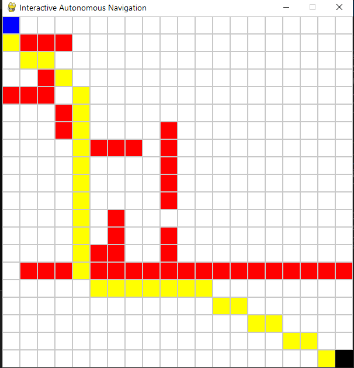
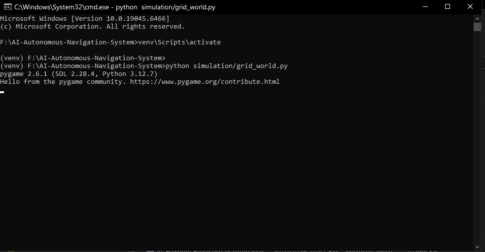

# 🚀 AI-Based Autonomous Navigation System

## 📌 Overview
This project features a virtual robot navigating from a starting point to a target destination while intelligently avoiding obstacles. The system utilizes the **A* (A-Star) Pathfinding Algorithm** to ensure efficiency and safety.

This simulation demonstrates core concepts used in **self-driving cars, warehouse automation (AGVs), and autonomous delivery systems**.

---

## 🎯 Problem Statement
Autonomous systems must navigate safely in complex, unpredictable environments without human intervention. This project showcases how AI can:
* **Plan optimal paths** using mathematical heuristics.
* **Avoid static obstacles** within a grid-based map.
* **Simulate real-time movement** and dynamic path recalculation.

---

## 🧠 Key Features
* 🎮 **Interactive 2D Simulation:** Built with Pygame for real-time visualization.
* 🧠 **A* Path Planning:** Implements a cost-based algorithm for the shortest path.
* 🚧 **Obstacle Avoidance:** Intelligent detection and navigation around barriers.
* 🔄 **Dynamic Recalculation:** Updates the path instantly if the environment changes.
* 🤖 **Smooth Robot Movement:** Realistic transitions across the grid.

---

## 🛠 Tech Stack
* **Python** (Core Logic)
* **Pygame** (Rendering and Interaction)
* **NumPy** (Efficient Grid Calculations)
* **OpenCV** (Planned for future Computer Vision integration)

## 🏗 System Architecture
Input (Start/Goal)` → `Grid Environment` → `A* Algorithm` → `Path Generation` → `Robot Movement` → `Real-time Visualization`

## 📁 Folder Structure

---

## ⚙️ Installation & Usage

### 1. Setup Environment
'''bash
# Create a virtual environment
python -m venv venv

# Activate the environment
# On Windows:
venv\Scripts\activate
# On macOS/Linux:
source venv/bin/activate

# Install dependencies
pip install pygame numpy
'''

### 2. Run the Simulation
'''bash
python main.py
'''
---

## 🎮 Controls
| Action | Control |
| :--- | :--- |
| **Set Start Point** | Left Click |
| **Set Goal Point** | Right Click |
| **Add/Remove Obstacles** | Click & Drag (Middle/Left) |
| **Start Simulation** | Spacebar / Enter |
| **Reset Grid** | 'R' Key |

---

## 📸 Results
* ✅ **Shortest Path Discovery:** Successfully finds the most efficient route.
* ✅ **Robust Navigation:** Handles complex maze-like structures.
* ✅ **Low Latency:** Real-time path updates with minimal computational overhead.

### 🧠 Simulation Output

### 💻 Terminal Output

---

## 🚀 Future Improvements
* 🔍 **Computer Vision:** Real-time object detection using **YOLO**.
* 🤖 **Hardware Integration:** ROS (Robot Operating System) support.
* 🚗 **Advanced Simulation:** Integration with **CARLA** or Gazebo for 3D environments.
* 🧠 **Machine Learning:** Implementing Reinforcement Learning for better decision-making.

---

🔗 **LinkedIn:** (https://www.linkedin.com/in/siddheshpate900/)

---

## ⭐ Support
If you find this project helpful, please give it a **Star** on GitHub!
